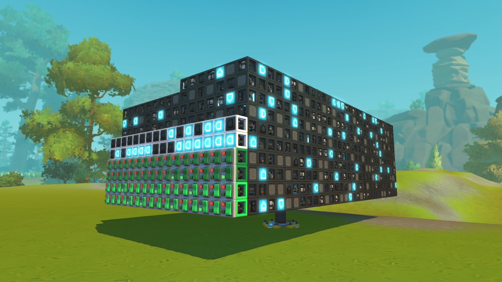

[](https://www.swift.org)
[](ghcr.io/yliu-hashed/sm-eda-bundle:latest)
[](https://store.steampowered.com/app/387990/)


# Scrap-Mechanic-EDA

Scrap Mechanic EDA is a set of EDA tools that bring industrial-level circuit design to the game Scrap Mechanic. This toolset consists of a series of command-line executables packaged in a docker container. It enables the creation of complex circuits with minimum effort.

This repo also serves as the SM-EDA Swift Package. By using this repo directly with SPM, you can develop a Swift program that interfaces with SM-EDA Netlist, Yosys Netlist, and SM Blueprints.

# Table of Contents

* [Quick Look](#quick-look)
* [What is SM-EDA](#what-is-sm-eda)
* [The SM-EDA Bundle](#the-sm-eda-bundle)
* [License](#license)
* [Install](#install)
* [Tutorials and Notes](#tutorials-and-notes)

# Quick Look

For example, the following Verilog code describes an 8-bit counter that counts up during clock rise but resets (synchronously) if RES is high.

```verilog
// Resources/Example-1/design.v
module counter(
  (* device = "button" *)
  (* color = "purple" *)
  input        CLK, // clock port
  (* color = "yellow" *)
  input        RES, // reset
  output [7:0] C
  );

  // Setup a register that holds 8 bits
  reg [7:0] register;
  assign C = register;

  always @(posedge CLK) begin
    if (RES) begin
      // Reset counter to zero if RES is high
      register <= 8'b0;
    end else begin
      register <= register + 1;
    end
  end
endmodule
```

After the complete synthesis flow using Yosys and SM-EDA, you get a behaviorally identical Scrap Mechanic blueprint: a resettable counter.


### A More Ridiculous Example

The following Verilog code describes a module that performs 32-bit integer division. This division module is purely combinational.

```Verilog
module divider(
  input  [31:0] A,
  input  [31:0] B,
  output [31:0] C
  );
  assign C = A / B;
endmodule
```

After the complete synthesis flow using Yosys and SM-EDA, you get this massive blueprint. It contains 4924 logic gates and 11947 connections. The critical path is 341 ticks (8.525s). This will take a week to build by hand.



The image above shows dividing 277,350,948 by 49 and obtaining 5,660,223.

```
// Don't believe me?
C = 0000'0000'0101'0110
    0101'1110'0011'1111 = 277,350,948
B = 0000'0000'0000'0000
    0000'0000'0011'0001 =          49
A = 0001'0000'1000'1000
    0000'1010'0010'0100 =   5,660,223
```

As you can see, SM-EDA makes building complex logical creations much more simple by automating the creation of any modules like this one.

# What is SM-EDA?

SM-EDA is a collection of custom tools that enable Electronic Design Automation (EDA) for Scrap Mechanic. All the tools are subcommands of a single command line executable `sm-eda`. The function of each tool is listed below.

- `sm-eda ys2sm`
  - Read Yosys JSON and convert it into SM netlist JSON
- `sm-eda place`
  - Read sm netlist JSON and generate a blueprint from it
- `sm-eda bram`
  - Generate a ram module netlist JSON using XOR-based DFF or timer-based memory with arbitrary size, addressability, and port configuration
- `sm-eda edit`
  - Perform edits on SM netlist JSONs, like merging different netlists, shorting, driving, and deleting ports, etc.
- `sm-eda sim`
  - Perform interactive, or scripted simulation on SM netlist JSONs
- `sm-eda show`
  - Visualize the netlist by exporting to [graphvis](https://graphviz.org) `.dot` format
  - Can be used to explore netlists visually

Almost all tools work by operating on a JSON netlist format tailored to Scrap Mechanic logic. This interchanged represents the logic network without solidifying them into a blueprint. It is designed to be passed around different tools. For example, you may run `sm-eda bram` first to generate a timer memory netlist, then use `sm-eda place` to create a blueprint.

# The SM-EDA Bundle

Although SM-EDA includes many useful tools, it is only the backend of a proper EDA pipeline.

We rely on [Yosys](https://github.com/YosysHQ/yosys) to parse, optimize, and techmap RTL designs written in HDL languages (like Verilog). Yosys is a generic synthesis frontend.

The *SM-EDA Bundle* is a docker image that contains both SM-EDA tools and Yosys. Installing the SM-EDA as a docker image is preferred, as it requires minimum setup and works out of the box. This docker image is built automatically via GitHub actions on every release, and the image is available via GitHub Packages.

To make Yosys work the way we want it to, we provide a custom synthesis script [script.ys](Resources/Flow/script.ys). We also provide cell libraries and other resources that the script use under [Resources/Flow](Resources/Flow/).

Yosys parses, optimizes, and techmaps the RTL design in Verilog, and our tool SM-EDA converts it into our netlist JSON and generates a blueprint. Together, Yosys and SM-EDA are the complete EDA pipeline.

If you want to know how all of this works, read the additional doc [Inner Workings](Docs/Inner-Workings.md).

Note that Yosys is an independent project, and we are not affiliated with them.

# License

This repo contains the source code of the tools in SM-EDA only. SM-EDA is released under [GPLv3](https://www.gnu.org/licenses/gpl-3.0). A [copy of this license](LICENSE) is available in the root directory of this repo. It is also available in the `/sm-eda` folder in the docker image, as well as the root folder of the binary release.

[Yosys](https://github.com/YosysHQ/yosys) is not part of this repo and is released under the ISC License. We do not intend to re-release Yosys, under a different license. However, if this behavior constitutes redistribution, the ISC license is compatible with GPLv3. Meanwhile, we have no intention to (and physically cannot) monopolize Yosys. Yosys is always available in [its own repo](https://github.com/YosysHQ/yosys).

# Install

## Install with Docker (Preferred)

First, [Install Docker](https://docs.docker.com/engine/install/). Then download the docker image by running the following command:

```bash
docker pull ghcr.io/yliu-hashed/sm-eda-bundle:latest
```

Then, run the image by running its bash in an interactive mode:

```bash
docker run -it ghcr.io/yliu-hashed/sm-eda-bundle:latest bash
```

Then, you should be able to do things in it. Commands like `yosys` and `sm-eda` will be immediately available inside the image. You can use `yosys -h` and `sm-eda -h` to verify that each tool in each package is working. You can now exit the image using `exit` or continue to [Example-1](/Resources/Example-1/).

Also, optionally [install GNU Make](https://www.gnu.org/software/make/) if you don't have it. It is a preferred way of saving you the trouble of typing lengthy commands for every build. You can optionally accomplish the same thing with shell scripts.

### Build Container from Source

If you wish to contribute to SM-EDA, you might want to also build the docker container from the sources. You should first [Install Docker](https://docs.docker.com/engine/install/). The following command will build the docker image from the sources.

```bash
# run the command from repo root
docker build -t sm-eda . -f Docker/Dockerfile
```

Note: Expect it to take roughly 20 minutes, since the container also has to build Yosys from source.

## Build Locally

Note: Local installations are **highly discouraged**. A multiplatform docker image is provided to save you trouble. But you can always install it locally if you want to. Keep in mind that you may encounter many hard-to-solve problems.

Since Swift on many platforms still needs to be matured, we do not distribute pre-built binaries other than the one in the docker container. If you wish to run sm-eda tools locally, you have to compile them yourself. If you are running Windows, doing all this in WSL is highly recommended.

1. [Install Swift](https://www.swift.org/download/)
2. Download the source code of this repo via `git clone` or your browser, and `cd` into it
3. Run `swift build -c release` to build the binaries
4. Add the built binaries to your `PATH` (built binaries normally are in `.build/release`)
5. (optional) Install [Yosys](https://github.com/YosysHQ/yosys) via [OSS CAD Suite](https://github.com/YosysHQ/oss-cad-suite-build#installation), from your OS's package manager, or build Yosys yourself.
6. (optional) [Install GNU Make](https://www.gnu.org/software/make/) - recommended to automate project build

If you have installed Yosys and SM-EDA locally, the samples below will not work due to them relying on the docker container. But since you somehow installed it locally, you should have no trouble modifying the examples as they are quite rudimentary. Typically, replacing `$(call DOCKER_RUN,<command>)` with `<command>` will just work.

The examples will also reference synthesis scripts inside the image like `/flow/script.ys` and `/flow/script.abc` that are not available on your machine under such paths. These scripts are available under [`/Resources/Flow/`](/Resources/Flow/) of this repo. You need to place them somewhere general and update everything to reference them. Scripts can often reference other scripts. For example, `script.ys` references `script.abc`.

# Tutorials and Notes

Going into this will require you to understand many industry-specific information. If you need help, [The NOOB Guide](NOOBGUIDE.md) is here to help. If you need more help, reach for the Discussions Tab of this repo.

To get started in SM-EDA, please view the two examples:

**[Resources/Example-1](Resources/Example-1)** - demonstrates how to use SM-EDA Docker Image from the command line.

**[Resources/Example-2](Resources/Example-2)** - demonstrates how to use GNU Make to construct an auto-building project.

If you are planning to make large circuits, read the note on [Docs/Logic-Limitation.md](Docs/Logic-Limitation.md) that talk about the blueprint size limit.

If you like to tinker, try reading the [Docs/Inner-Workings.md](Docs/Inner-Workings.md). This talks about how all this work under the hood.
